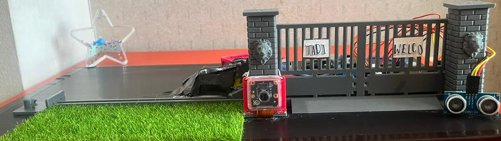
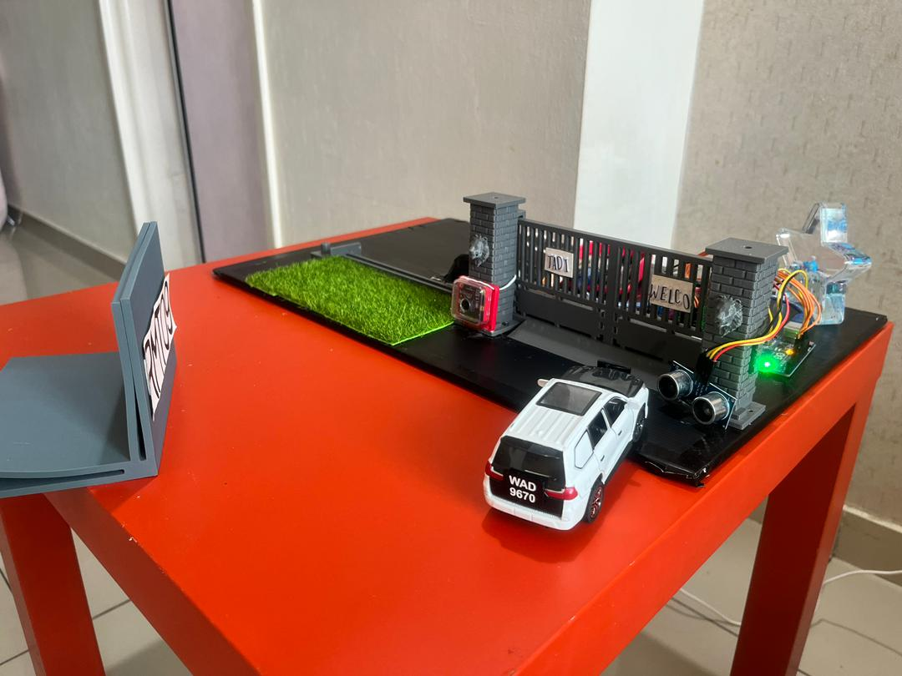
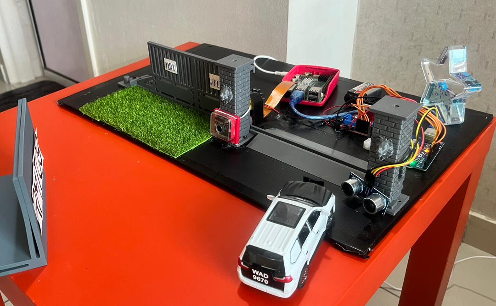
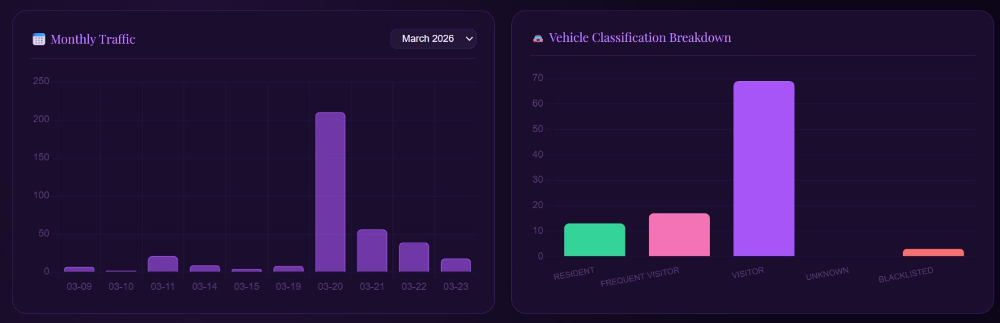
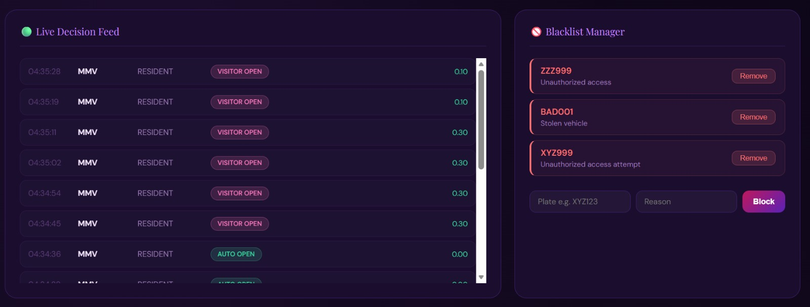

# 🚗 FYP APLR Home Smart Gate System

An AI-powered smart gate system using YOLOv5 for vehicle licence plate recognition, 
with MQTT integration, anomaly detection, and a real-time dashboard.

---

## 📸 Project Images

### 🔧 Smart Gate System

### ⚙️ Gate System Hardware

### 🔒 Closed Gate

### ✅ Opened Gate

### 📊 Dashboard

---

## 🎥 Project Demo

▶️ [Watch Full Demo Video](YOUR_YOUTUBE_OR_LINKEDIN_LINK_HERE)

---

## 🛠️ Tech Stack
- YOLOv5 (Object Detection)
- Python, OpenCV
- MQTT Protocol
- Flask Dashboard (HTML/CSS)
- Raspberry Pi / HC-SR04 Proximity Sensor
